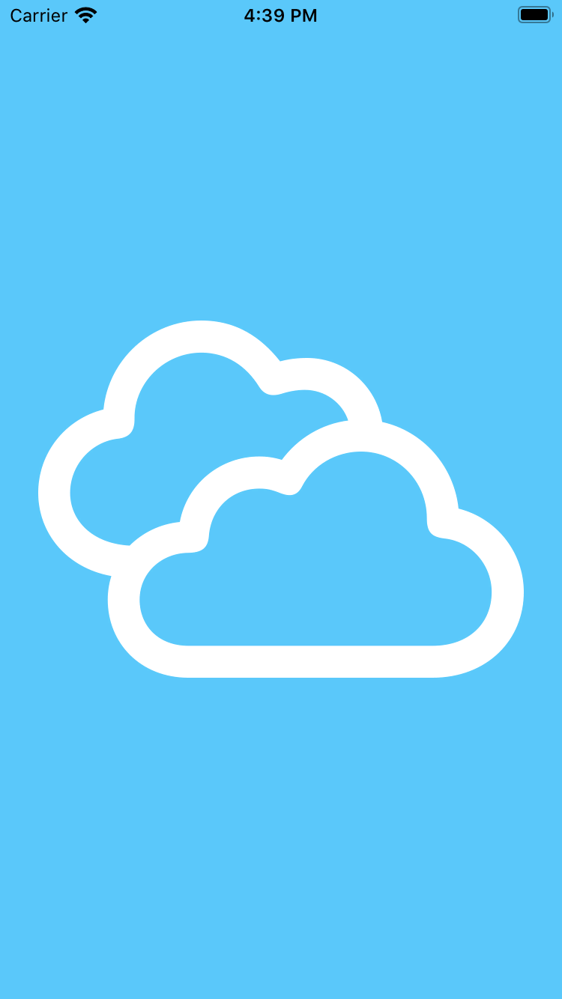
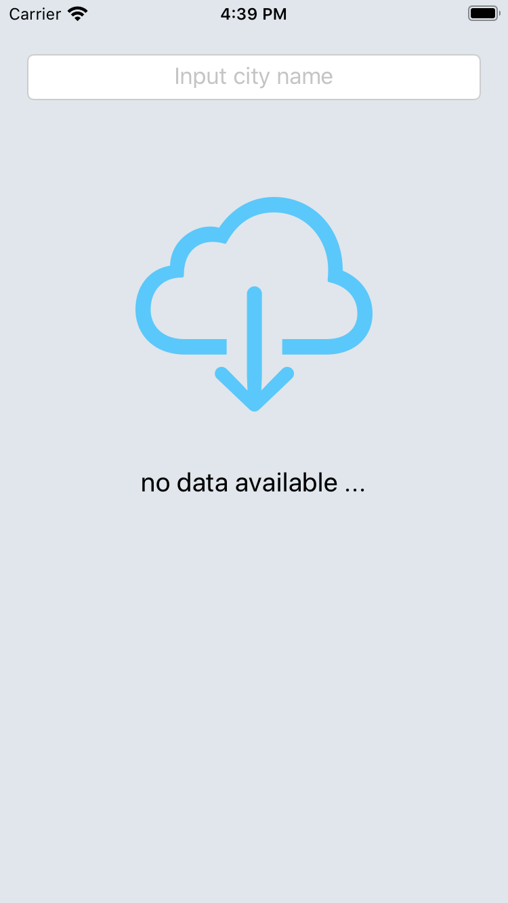
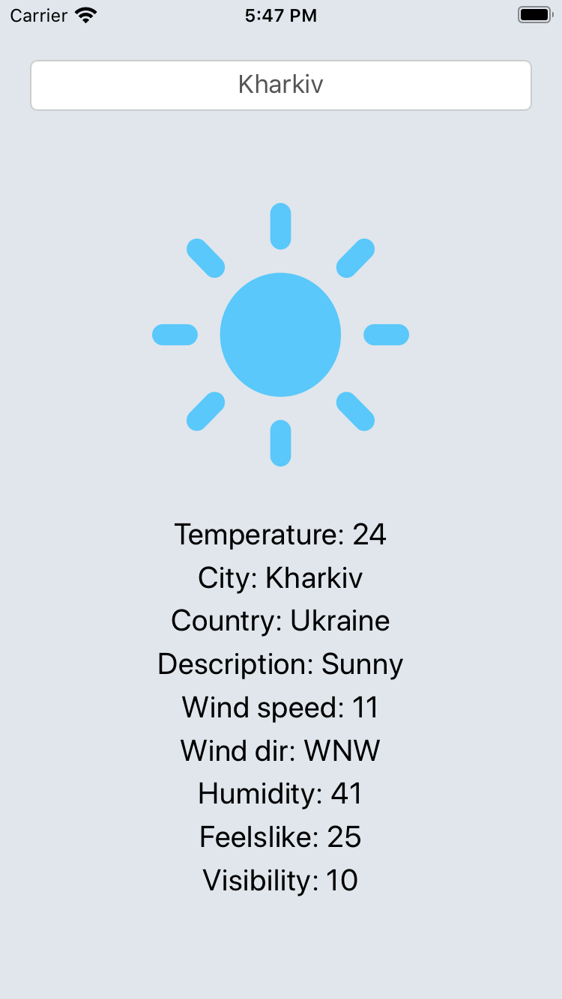
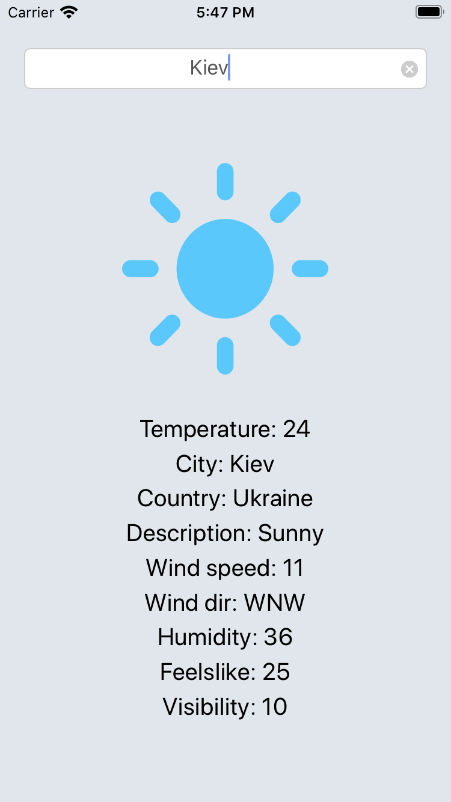

# Weather application

A single application that returns data from [Weatherstack](https://weatherstack.com) and parses the JSON into viewable results. 

    
    
    
    

## Getting Started

    

The first step to using the API is to authenticate with your weatherstack account's unique API access key, which can be found in your account dashboard after registration. To authenticate with the API, simply use the base URL below and pass your API access key to the API's access_key parameter. ([Details](https://weatherstack.com/documentation))

# Installation
1. Install Cocoapods: sudo gem install cocoapods
2. Update pods in folder: pod update
3. Install [RxSwift & RxCocoa](https://github.com/ReactiveX/RxSwift#installation)
4. Install [Alamofire](https://github.com/Alamofire/Alamofire#installation)
5. Build project from Xcode.

